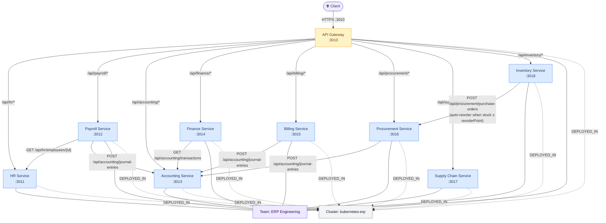

# ERP Microservices — Dependency Graph

This document visualizes the full service dependency graph for the Enterprise Resource Planning system: every node (service, team, cluster, deployment, endpoint) and every directed edge (ownership, deployment, routing, cross-service HTTP calls).

---

## Service-Level Dependency Map



---

## Node Inventory

### APIs (9 microservices)

| Service | Port | Description |
|---------|------|-------------|
| **API Gateway** | 3010 | Single public entry point — reverse-proxies all traffic |
| **HR Service** | 3011 | Employee and department management |
| **Payroll Service** | 3012 | Salary processing, tax calculations, payroll approval |
| **Accounting Service** | 3013 | General ledger, journal entries, financial transactions |
| **Finance Service** | 3014 | Budgeting, financial reports, department budget summaries |
| **Billing Service** | 3015 | Customer invoicing, payments, billing lifecycle |
| **Procurement Service** | 3016 | Purchase orders, vendor management, auto-reorder POs |
| **Supply Chain Service** | 3017 | Shipments and logistics (independent — no upstream calls) |
| **Inventory Service** | 3018 | Stock management, reservations, automatic reorder triggering |

### Infrastructure

| Node | Type | Detail |
|------|------|--------|
| ERP Engineering | Team | Owns all 9 microservices |
| kubernetes-erp | Cluster | Kubernetes, namespace `erp` — all 9 production Deployments |

---

## Edge Inventory

### OWNED_BY — API → Team

All 9 APIs are owned by **ERP Engineering**.

### DEPLOYED_IN — Deployment → Cluster

All 9 production Deployments run on **kubernetes-erp**.

### EXPOSES — API → Endpoint (complete endpoint catalogue)

#### API Gateway
| Method | Path | Notes |
|--------|------|-------|
| GET | `/health` | Aggregate health — polls all 8 downstream `/health` endpoints |
| GET | `/api` | Service catalogue |
| GET/POST | `/api/hr/{path}` | Proxy → HR Service |
| GET/POST | `/api/payroll/{path}` | Proxy → Payroll Service |
| GET/POST | `/api/accounting/{path}` | Proxy → Accounting Service |
| GET/POST | `/api/finance/{path}` | Proxy → Finance Service |
| GET/POST | `/api/billing/{path}` | Proxy → Billing Service |
| GET/POST | `/api/procurement/{path}` | Proxy → Procurement Service |
| GET/POST | `/api/supply-chain/{path}` | Proxy → Supply Chain Service |
| GET/POST | `/api/inventory/{path}` | Proxy → Inventory Service |

#### HR Service
| Method | Path |
|--------|------|
| GET | `/api/hr/employees` |
| POST | `/api/hr/employees` |
| GET | `/api/hr/employees/{id}` |
| PUT | `/api/hr/employees/{id}` |
| PATCH | `/api/hr/employees/{id}/promote` |
| POST | `/api/hr/employees/{id}/terminate` |
| GET | `/api/hr/departments` |
| POST | `/api/hr/departments` |
| GET | `/api/hr/departments/{id}` |
| GET | `/api/hr/statistics` |

#### Payroll Service
| Method | Path |
|--------|------|
| POST | `/api/payroll/process` |
| POST | `/api/payroll/process-batch` |
| POST | `/api/payroll/{id}/approve` |
| GET | `/api/payroll` |
| GET | `/api/payroll/{id}` |
| GET | `/api/payroll/employee/{id}` |

#### Accounting Service
| Method | Path |
|--------|------|
| POST | `/api/accounting/journal-entries` |
| GET | `/api/accounting/transactions` |
| GET | `/api/accounting/transactions/{id}` |
| GET | `/api/accounting/general-ledger` |
| GET | `/api/accounting/trial-balance` |

#### Finance Service
| Method | Path |
|--------|------|
| POST | `/api/finance/budgets` |
| GET | `/api/finance/budgets` |
| GET | `/api/finance/budgets/{id}` |
| POST | `/api/finance/budgets/{id}/close` |
| GET | `/api/finance/budgets/{id}/utilization` |
| GET | `/api/finance/departments/{id}/budget-summary` |
| GET | `/api/finance/reports` |

#### Billing Service
| Method | Path |
|--------|------|
| POST | `/api/billing/customers` |
| GET | `/api/billing/customers` |
| GET | `/api/billing/customers/{id}` |
| GET | `/api/billing/customers/{id}/balance` |
| POST | `/api/billing/invoices` |
| GET | `/api/billing/invoices` |
| GET | `/api/billing/invoices/{id}` |
| POST | `/api/billing/invoices/{id}/send` |
| POST | `/api/billing/invoices/{id}/payments` |
| POST | `/api/billing/invoices/{id}/cancel` |
| GET | `/api/billing/invoices/overdue` |

#### Procurement Service
| Method | Path |
|--------|------|
| POST | `/api/procurement/vendors` |
| GET | `/api/procurement/vendors` |
| GET | `/api/procurement/vendors/{id}` |
| GET | `/api/procurement/vendors/{id}/performance` |
| POST | `/api/procurement/purchase-orders` |
| GET | `/api/procurement/purchase-orders` |
| GET | `/api/procurement/purchase-orders/{id}` |
| POST | `/api/procurement/purchase-orders/{id}/approve` |
| POST | `/api/procurement/purchase-orders/{id}/place` |
| POST | `/api/procurement/purchase-orders/{id}/receive` |
| POST | `/api/procurement/purchase-orders/{id}/cancel` |

#### Supply Chain Service
| Method | Path |
|--------|------|
| POST | `/api/supply-chain/shipments` |
| GET | `/api/supply-chain/shipments` |
| GET | `/api/supply-chain/shipments/{id}` |
| GET | `/api/supply-chain/shipments/tracking/{number}` |
| GET | `/api/supply-chain/shipments/order/{id}` |
| POST | `/api/supply-chain/shipments/{id}/dispatch` |
| PUT | `/api/supply-chain/shipments/{id}/status` |
| POST | `/api/supply-chain/shipments/{id}/deliver` |
| POST | `/api/supply-chain/shipments/{id}/cancel` |
| GET | `/api/supply-chain/carriers/performance` |
| GET | `/api/supply-chain/inbound/summary` |
| GET | `/api/supply-chain/outbound/summary` |

#### Inventory Service
| Method | Path |
|--------|------|
| POST | `/api/inventory/items` |
| GET | `/api/inventory/items` |
| GET | `/api/inventory/items/{id}` |
| GET | `/api/inventory/items/sku/{sku}` |
| PUT | `/api/inventory/items/{id}` |
| POST | `/api/inventory/stock/adjust` |
| POST | `/api/inventory/stock/reserve` |
| POST | `/api/inventory/stock/release` |
| POST | `/api/inventory/stock/fulfill` |
| POST | `/api/inventory/stock/receive` |
| GET | `/api/inventory/low-stock` |
| GET | `/api/inventory/valuation` |
| GET | `/api/inventory/categories` |

---

### CALLS — Endpoint → Endpoint (cross-service HTTP)

All calls are synchronous HTTP with graceful degradation (`try/except`; the caller continues on failure).

```
Payroll  POST /api/payroll/process
  ├─► HR       GET  /api/hr/employees/{id}          (resolve employee data)
  └─► Accounting POST /api/accounting/journal-entries (record payroll expense)

Billing  POST /api/billing/invoices
  └─► Accounting POST /api/accounting/journal-entries (record revenue entry)

Finance  GET  /api/finance/budgets/{id}/utilization
  └─► Accounting GET  /api/accounting/transactions    (fetch actuals)

Finance  GET  /api/finance/reports
  └─► Accounting GET  /api/accounting/transactions    (fetch actuals)

Procurement POST /api/procurement/purchase-orders
  └─► Accounting POST /api/accounting/journal-entries (record PO expense)

Inventory POST /api/inventory/stock/adjust
  └─► Procurement POST /api/procurement/purchase-orders
                                                       (auto-reorder when qty ≤ reorderPoint)
```

---

## Accounting Service — Fan-In Analysis

**Accounting** is the most depended-upon downstream service (4 callers, 5 call sites):

| Caller | Endpoint called | Trigger |
|--------|----------------|---------|
| Payroll | `POST /api/accounting/journal-entries` | Payroll processing |
| Billing | `POST /api/accounting/journal-entries` | Invoice creation |
| Procurement | `POST /api/accounting/journal-entries` | Purchase order creation |
| Finance | `GET /api/accounting/transactions` | Budget utilization report |
| Finance | `GET /api/accounting/transactions` | Financial reports |

> **Risk note:** Accounting is a single point of failure for write-path financial recording. Payroll, Billing, and Procurement all degrade gracefully (calls are fire-and-forget), but any failure silently drops journal entries. Consider adding an async queue (e.g. RabbitMQ) as the architecture matures.

---

## ASCII Service Map

```
Clients
   │
   ▼
┌──────────────────────────────────────────────────────────────┐
│                       API Gateway :3010                      │
│  /api/hr/*  /api/payroll/*  /api/accounting/*  /api/v2/*     │
└──────────────────────────┬───────────────────────────────────┘
                           │ HTTP (internal, synchronous proxy)
   ┌───────────────────────┼──────────────────────────────┐
   │           │           │           │           │       │
   ▼           ▼           ▼           ▼           ▼       ▼
 [HR]      [Payroll]  [Finance]   [Billing]   [Supply  [Inventory]
 :3011      :3012      :3014       :3015       Chain]   :3018
             │  │        │           │         :3017       │
             │  │  calls │     calls │                     │
             │  └──────► │           │                     │ auto-
             │            ▼           ▼                     │ reorder
             │        [Accounting Service :3013] ◄──────────┘
             │             ▲                        ▲
             └─────────────┘               [Procurement :3016]
              (payroll expense)
```
